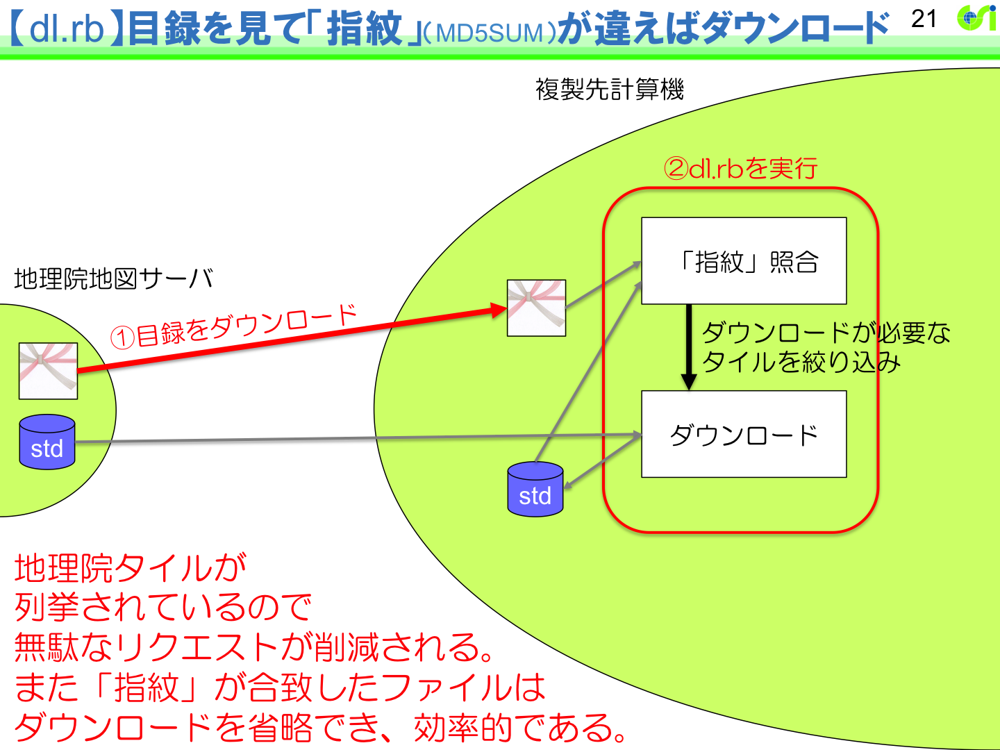
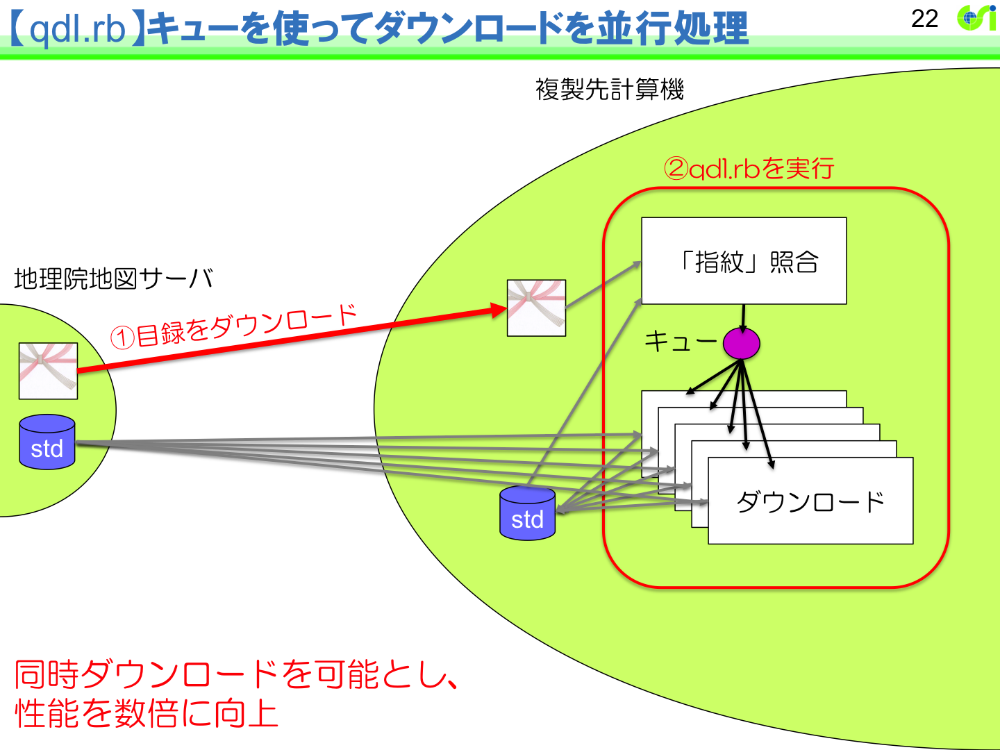
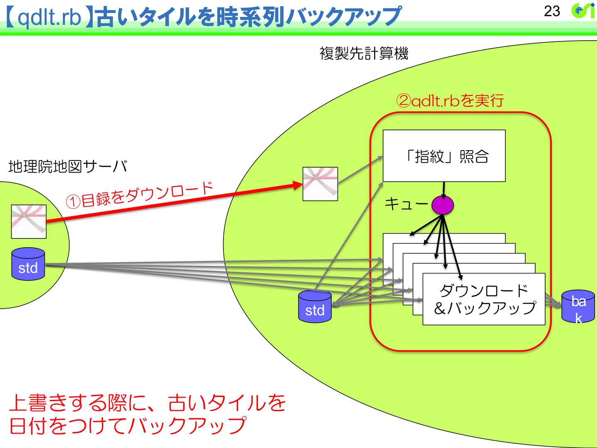
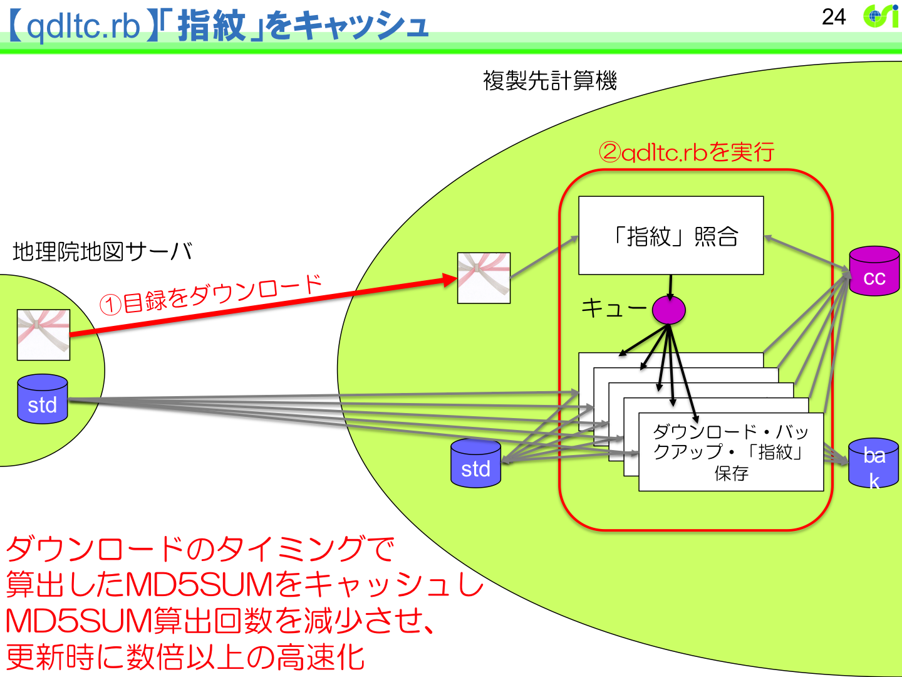

# 地理院タイル目録を用いた地理院タイルの効率的な同期方法
# An effective synchronization method of GSI Tiles using a GSI Tile List

地理空間情報部　情報普及課　藤村　英範
Information Access Division, Geospatial Information Department
Hidenori FUJIMURA

## 要旨
電子地形図（タイル）をはじめとする基本測量成果を含み，政府オープンデータ戦略に基づいて国土地理院コンテンツ利用規約に従い提供されるウェブ地図用地理空間情報「地理院タイル」は，基本図（地形図），写真（オルソ画像），主題図，災害情報を含む1,000レイヤを超える情報セットとなっている．これら地理院タイルは，もっぱらインターネット提供により提供を行う方針となっており，情報普及課が運用する地理院地図タイル用ウェブサーバである「地理院地図サーバ」の可用性を確保しつつ，測量法第27条第2項に基づくインターネット提供を適切に実施する必要があった．このため，地理院地図サーバから提供する地理院タイル一枚一枚の所在情報である「地理院タイル目録」を整備し，提供実験に供している．地理院タイル一枚一枚の更新日付や MD5SUM を記録した地理院タイル目録を利用することにより，地理院タイルのダウンロード及び同期を効率的に進めることができる．国土地理院が実施している，週あたり数万タイルに及ぶ基本測量成果の迅速更新の状況を反映するため，地理院タイル目録の更新は週次のタイミングで実施しているところである．さらに，地理院タイル目録を用いて実際に地理院タイルを効率的にダウンロードし，ダウンロードした地理院タイルを地理院地図サーバの最新の地理院タイルに効率的に同期できるプログラム（リファレンス実装） qdltc を作成し公開した．qdltc を用いると，電子地形図（タイル）である地理院タイル（標準地図）約5,000万タイルを7日間程度でダウンロードでき，週毎の最新の地理院タイルへの同期（約数万タイル）を7時間程度で実施することができる．


## 背景
地理空間情報部情報普及課では，1880年代から取り組まれてきた地形図作成の最新の成果である基本測量成果「電子地形図（タイル）」を含むウェブ地図向け地理空間情報「地理院タイル」を提供している．「地理院タイル」は，基本図（地形図），写真（オルソ画像），主題図，災害情報を含む1,000レイヤを超える膨大な情報セットとなっている．

また，地理院タイル利用のショーケースとして，国土地理院のウェブ地図「地理院地図」（国土地理院，2015a）を運営している．地理院地図は，その前身である「電子国土ポータル」（平成15年（2003年）7月15日開設）から通算すると，平成27年7月で運営12周年となり，この間，24時間365日無停止を目標として運営を継続してきた．

地理院タイル及び地理院地図の提供を通じて，情報普及課は，国土地理院が捉える日本の姿を，ウェブを通じて日本や世界に継続的に提供している．

情報普及課では，平成27年7月現在，地理院タイルの活用を推進するための3つの施策として「オープンデータ施策，オープンソース施策，オープンイノベーション施策」を掲げている．

オープンデータ施策は，地理院タイルを政府オープンデータ戦略に基づきわかりやすい利用規約で多様な活用を推進することであり，
平成26年（2014年）9月30日に政府標準利用規約（第1.0版）に基づく国土地理院コンテンツ利用規約が施行された日に，地理院タイルの利用規約を当該規約に移行している．国土地理院コンテンツ利用規約は「複製，公衆送信，翻訳・変形等の翻案等，自由に利用できます．商用利用も可能です」を基本精神とする利用規約であり，出典の掲載により自由に利用できることを原則としている．国土地理院コンテンツ利用規約は著作権法に関わる規約である一方，測量法は国土地理院コンテンツ利用規約でも個別法令として取り扱われる別個の規定であり，情報普及課においても，基本測量成果である地理院タイルについても，より円滑に測量法に基づく複製承認・使用承認申請ができるよう，技術者等と対話を進めているところである．

オープンソース施策は，地理院タイル利用のショーケースである地理院地図をオープンソースソフトウェアで構築し，構築した地理院地図自身もオープンソースソフトウェアとして提供する（国土地理院，2015b）という施策であり，平成24年（2012年）7月26日から開始されている．業界で共有すべき機能や技術を広く共有し，業界全体の技術競争力を底上げすることで，ウェブ地図を通じた地理空間情報の活用を推進することを目的としている．

オープンイノベーション施策は，外部との連携を積極活用し，連携する各主体がイノベーティブな成果を得ることを追求するものである．地理院タイル提供においてオープンイノベーションの考えを取り入れるのは，地理空間情報の多様なニーズ，特に多様な業務ニーズに対応するためには，それぞれの利用分野に明るい事業者との連携が必須であるためである．多様なニーズに国土地理院単独ではなく業界全体で応えるため，業界標準を見極めながら地理院地図の各機能のモジュール化を進め，機能を切り出したり入れ替えたりできる技術的環境を整えるとともに，受託開発者やツール提供者との情報共有・意見交換のための「地理院地図パートナーネットワーク」を平成26年（2014年）7月11日から開設し，平成26年（2014年）11月，平成27年（2015年）2月及び6月には「地理院地図パートナーネットワーク会議」を開催した．地理院地図の各機能のモジュール化の嚆矢としては，平成25年（2013年）10月30日の地理院タイルの「XYZ（slippy map tilenames）方式」採用が挙げられる．多くのソフトウェアが対応しているタイル命名規則を採用することにより，ソフトウェア間の自由な競争を促進し，多様な業務ニーズへの対応可能性が開かれた．地理院タイルに対応したデスクトップアプリケーションやモバイルアプリケーションが増加し，地理院地図自身も，平成27年（2015年）1月8日に，その依拠するウェブ地図ライブラリを OpenLayers から Leaflet に容易に移行することができた．また，地理院地図パートナーネットワークには，平成27年（2015年）6月30日現在121者の参加があり，これら地理院地図パートナーと呼ばれる参加者は，会議での議論に参加するほか，地理院地図パートナーネットワークのウェブサイト（国土地理院，2015c）で，地理院タイルのアプリケーションについての情報を集約した「地理院地図パートナーリスト」を共同で公開している．

また，情報普及課では，平成27年7月現在，地理院地図の今後を方向づける3つの技術として「標高タイル，ベクトルタイル，デジタルファブリケーション」を掲げている．

標高タイルは，基盤地図情報の数値標高モデルに基づく標高データをウェブ地図形式によって提供するものである．ウェブ地図用タイルデータの各ピクセルの位置について算出した標高値をタイルデータに格納し，いわば「pixel-perfect DEM for web maps」として提供するものであり，タイルデータのフォーマットには現在 CSV 形式を用いている（国土地理院，2013）．標高タイルは，地理院地図で地図中心の標高値をテキスト表示するためのバックデータとして使われる一方，平成26年（2014年）3月19日に公開された「地理院地図3D」（国土地理院，2015d）では，地形模型をウェブブラウザ上で表現するとともに3Dプリンタ用データとして出力するためのバックデータとしても使われている．また，首都大学東京渡邉研究室が公開している「ヒロシマ・アーカイブ」（ヒロシマアーカイブ制作委員会, 2015）では，アースブラウザを実現するライブラリである Cesium （Analytical Graphics, Inc., 2015） で地形を詳細に表現するために国土地理院の標高データがバックデータとして使われている（首都大学東京，2015）．

ベクトルタイルは，属性が付与された点・線・面のベクトルデータをウェブ地図形式によって提供するものである．平成26年（2014年）8月1日に提供区域を限定して道路中心線のベクトルタイルデータを提供実験に供して以来，段階的に提供実験を進め，平成27年（2015年）6月4日には，全国の注記ベクトルタイルを，地理院地図にも組み込む形で提供実験を開始した．ベクトルデータをタイル形式で配信することにより，ウェブブラウザ側での表現調整や処理等が可能となり，より多様な用途に対応することができるようになる．また，特に高精細なディスプレイを持つモバイルデバイス等では，レンダリングをデバイス側で行うことにより，地図をよりくっきりと提示することが可能となる．さらに，大量の情報もベクトルタイル形式で重ね合わせることでより容易にウェブ地図と連携できるようになった．地理院地図でも，過去の写真や地盤情報をベクトルタイルで重ね合わせることにより，大量のポイントデータをより大量に．より高速に提示することに成功している．

デジタルファブリケーションは，データに基づいて素材を加工し，多様にカスタマイズ可能なものづくりを可能とする技術体系であり，データのインターネット配信と加工機械のパーソナル化を前提とする技術体系となっている．地理空間情報部では地理院地図3Dの公開に先立って3Dプリンタを導入し，デジタルファブリケーションの世界に基盤地図情報に基づく地形模型を普及させた．地理空間情報を情報端末でも紙でもないメディアで活用することを提案することで，情報端末の電源の制約や汚損しやすい紙の性質から自由で，新しい理解を与える情報表現の世界を広げることを狙っている．新しい活用を亭亜することで，地理空間情報の活用推進をより活性化させることが目的である．

## 解決すべき課題
電子地形図の実績を踏まえ，地理院タイルの「標準地図」，「淡色地図」及び「English」を基本測量成果として安定供給できる状況が整ったことから，これらのデータについて平成26年7月1日付官報（本紙 第6322号）において測量法第27条第1項に基づく公告を実施した．これにより，これら3レイヤの総称として「電子地形図（タイル）」という名称の運用が開始され，当該データの安定的なインターネット提供及び迅速な更新が担保されることとなった．なお，その後，地理院タイルとなっている「数値地図25000（土地条件）」及び「数値地図5000（土地利用）」についても同様に基本測量成果としての取り扱いが開始された．

一方，これらの基本測量成果を測量法第27条第2項に基づき提供する手段としては，もっぱらインターネット提供を用いる方針となっており，情報普及課が運用する地理院地図タイル用ウェブサーバである「地理院地図サーバ」の可用性を確保しつつ，当該インターネット提供を適切に実施する必要があった．従前，紙地図を閲覧所で閲覧すること（測量法第27条第3項）に相当するウェブブラウザ等での閲覧を念頭に設計されていた地理院地図サーバに，新しい任務が追加されたことになる．特に，紙地図を書店で購入することに相当する，タイルデータのダウンロードについては，効率的な手段を拡充する必要が生じた．

基本測量成果である「電子地形図（タイル）」には，ほかの電子地形図シリーズと同様に，国土地理院の基本測量によるデータの迅速更新が反映されることになる．これにより，週あたり数万タイルの更新が行われることとなる．測量の精度確保の観点からも，これら迅速更新を，地理院地図サーバのみならず，ダウンロード頂いたデータセットにも効率的に適用する手段を提供する必要が生じた．データセットの時間精度要求は，利用者の用途により異なることから，同期を特定の頻度で行っていただくことを強制することはできない．このため，同期アルゴリズムは，同期するデータの鮮度がばらついていても適用できるようにする必要があった．

地理院タイルのダウンロード機能・性能の拡充の必要は，基本測量成果である地理院タイルに限定されない．基本測量成果ではない地理院タイルにおいても，国土地理院コンテンツ利用規約の「複製，公衆送信，翻訳・変形等の翻案等，自由に利用できます．商用利用も可能です」という基本精神を実践するためには，ただ地理院地図において地理院タイルを閲覧して頂くだけではなく，地理院タイルを必要に応じてダウンロードして頂き，さらには常に最新の地理院タイルに同期して頂く手段を提供することが必要となった．

地理院タイルを効率的にダウンロードし同期していただける機能が提供できない場合，当該データを総当たりで非効率にダウンロードするアクセスが増加し，地理院地図の可用性にも悪影響を及ぼす恐れがあった．

### 技術的詳細
地理院タイルが利用しているタイル方式は，経緯度により矩形に区画された地理学的空間に地理空間情報を細分化する．タイル方式は，表示する等のために特定された地理学的位置からタイル番号を算出し，当該位置のデータを取り出すには有利である．具体的には，データ量Nに対してO(1)の計算量で特定位置データを取り出すことができると言える．

一方で，例えば市区町村の全領域，日本国の全領域といった単位のデータを取り出すためには，当該領域にかかるタイルのタイル番号のリストを得て，当該タイルを取得する必要があるが，これまでそのようなリストは提供されていないかった．さらに，地図の更新により，タイルセットは部分的に入れ替わる．タイルセットの同期を行うためには，更新が必要なタイルと更新が不要なタイルを区別するための情報を提供することが有利である．これらの情報を集約したリスト（以下，「地理院タイル目録」という．）を開発する必要があった．なお，開発時点で標準地図の全国分のタイル数は5000万程度，地理院タイル全数のタイル数は2億程度あることが分かっていた．

地理院タイル目録を用いた具体的なデータ更新方法の設計にあたっては，従前の地理院タイル提供との親和性を重視し，サーバ側に追加のコストがからず，従前の地理院タイル提供との相乗効果が得られるようにすることとした．地理院タイルは地理的に細分化されているものの静的なHTTPリソースとして提供されるため，Contents Delivery Network (CDN)を活用し，HTTPキャッシュの仕組みを活用して高速配信を図っていた．また，新たなダウンロード提供によって別個の巨大リソースの配信を開始することは，配信環境の追加投資が困難であるため，コスト的に困難であった．このため，地理院タイルについては，従前のアクセス用のデータと，ダウンロード用のデータは同一であるべきであると考えた．ダウンロード対象とするデータを，個別のタイルそのものとすることで，新たなキャッシュ対象HTTPリソースを増やすことなく，むしろ同じキャッシュを共用することとした．

また，地理院タイルは頻繁に追加・更新されること，特に基本測量成果である電子地形図（タイル）については，迅速更新により，週あたり数万タイルオーダーのタイルが更新されることを考慮する必要があった．地理院タイルのダウンロードをする利用者は，利用者各自の時間精度要求に応じてタイル更新を実施することが想定される．このため，例えば一定期間ごとにパッチデータを作成するようなアプローチの場合には，サーバ側に大量のパッチを蓄積する必要がある上に，利用者側でパッチの適用漏れが発生する恐れがあった．このため，タイル単位で利用者側手元のタイルと，サーバ側の最新タイルセットのタイルとの同一性を比較し，差異があるタイルのみをダウンロードするアプローチをとることとした．

最後に，基本測量成果としての告示はすでに実施されていることから，基本測量成果としての複製・使用を円滑に実施して頂くため，地理院タイルのダウンロード支援は一刻も早く実施する必要があった．この前提条件により，地理院タイルの生産及びアップロードのフローを改変することを伴わずに，現状を前提としてダウンロードの手段を開発・提供する必要があった．

### 開かれる新たな応用
上記課題を解決することにより開かれる新たな応用として，次のようなユースケースを想定した．

#### 業務システムでの利用
国土地理院では，政府機関や地方公共団体での地理院タイルの利用を積極的に支援している．その中で頻出するユースケースとして，インターネットアクセスを前提としない業務システムでの地理院タイルの利用がある．情報セキュリティ上の設計として，または災害対応システムとしてインターネット接続が途絶しても運用できるようにするために，インターネットを通じて地理院タイルを得ることを前提としない業務システムは多い．従前は，政府機関や地方公共団体に対しては便宜供与として国土地理院から地理院タイルのコピーを提供していたが，地理院タイル目録を用いた同期方法を利用することにより，地理院タイルの提供をオンライン化することができるようになる．このことにより，USBハードディスクドライブへの書き出しや当該デバイスの郵送のような作業を省略することができるようになるため，省力化を進めることが可能となってくるほか，地理院タイルのコピーの鮮度を大きく向上することができる．

情報セキュリティの観点からインターネット接続をしないサーバに対しては，インターネット接続された近接の環境においてポータブルドライブに地理院タイルをダウンロード・同期し，そのドライブを検証後にサーバに接続することによって，地理院タイルの更新を行うことが可能となる．また，平時はインターネット接続するサーバであって，災害対応時等にインターネットが途絶しても地理院タイルを閲覧できるようにするサーバであれば，夜間バッチ等で地理院地図サーバと地理院タイルを同期することとすれば，災害対応時にオフライン化できるようになる上，平常時には地理院タイルあへのアクセスを高速化するキャッシュとして動作することができるようになる．

#### 現場システムでの利用
現場システムも，高速なインターネット接続を想定することが難しいシステムである．このため，行動期間中に変更されることが想定されない地図データについては，現場に入る前にオフラインキャッシュしておくことがよく行われる．従前より，地理院タイルを利用した特にモバイルアプリケーションやタブレットアプリケーションにおいて，指定範囲の地理院タイルをキャッシュする機能が実装される例は多かった．地理院タイル目録を用いた効率的なダウンロード・更新方法を用いることにより，より広い範囲について効率的にキャッシュを構築・維持することが可能となる．

## 地理院タイル目録
### 地理院タイル目録を作成する優位性
地理院タイル目録とは，地理院タイルの一枚一枚について，その所在と諸元を収録したCSV形式のテキストファイルである．

地理院タイル目録を作成することを発生したきっかけとしては，地理院タイルへのアクセスを時系列で地図上に可視化した際に，洋上のタイルを舐めるようなアクセスが散見されたことが挙げられる．日本のような細長い国土においては，国土の包含矩形領域に含まれるタイルに総当たりでHTTPリクエストをかけると無駄が多い．この無駄は，ダウンロード者のみならず地理院地図サーバ運用者にも負担となる．

TODO: 余力・余白があれば，矩形総当たりから目録利用に移ることによるリソース絞り込みを定量的に示す．

### 地理院タイル目録の仕様
地理院タイル目録は，タイルセットに対して一つ必要なものであるため，タイルセットのディレクトリの直下に mokuroku.csv.gz という名称で配置することをデフォルトとした．タイルセットのテンプレート URL が http://server/t/{z}/{x}/{y}.ext であれば，その地理院タイル目録の URL は http://server/t/mokuroku.csv.gz と定まる．地理院タイル目録の分量は膨大となる場合があるため，csv 形式のファイルを gzip 圧縮した csv.gz 形式のファイルとして配置することとした．

地理院タイル目録の CSV データの形式は，平成27年7月現在，次のとおりである．

（パス）,（最終更新時刻）,（サイズ）,（MD5SUM）

ここで，パスはテンプレートURLの {x}/{z}/{y}.ext 部分とした．パスからURLへの変換は，http://server/{t}/（パス）となる．

また，最終更新時刻はUNIX起算時を整数化したものとしている．サイズの単位はバイトである．

MD5SUM は，当該タイルデータについて算出した MD5 のハッシュ値である．MD5 のハッシュ値を保存する理由は，国土地理院の迅速更新において，現状，矩形の作業区画単位にデータ編集を行い，その作業区画内のタイルの全数を再度レンダリングすることにしているためである．このため，内容の更新がされていないが再度レンダリングされてしまうタイルが大量に発生する．最終更新日付ではなくMD5SUMを用いて比較することにより，このような「見かけの更新」が行われたタイルについては更新を省略することができるようになる．

これら地理院タイル目録の仕様については，情報技術者のソーシャルネットワーキングサイトとも言えるソーシャルコーディングサイト GitHub に公開（国土地理院，2015e）し，常に改善リクエストを受け入れられる状態としている．

地理院タイル目録のサイズは，標準地図約5,000万タイル，350GBに対して csv.gz 形式で 1.2GB 程度となる

なお，タイルセットのディレクトリ直下にデフォルト名称を決めて配置する規約としているデータとして，国土地理院情報普及課では，ベクトルタイルのスタイル情報 style.js も提唱している（国土地理院，2015f）．

ここで，地理院タイル目録の MD5SUM を用いて地理院タイルを同期する方法と，rsync コマンドを用いて地理院タイルを同期する方法を比較する．rsync コマンドを用いた場合，ダウンロード元とダウンロード先の比較とのためのリスト算出をコマンド投入時の前半段階で行う．地理院タイル目録は，ダウンロード元のリストをハッシュ値もふくめてあらかじめ算出したものに相当する．rsync を用いた場合，ダウンロード試行回数 m に対して m 回のリスト算出が発生するが，地理院タイル目録の作成は m には独立である．地理院タイル目録の作成は同期コマンドのタイミングに影響されない，地理院タイルサーバの遊休時間に行われるため，地理院地図サーバの運用者にとっても，地理院タイルのダウンロード者にとっても資源節約となる．なお，rsync 採用を検討した際には，地理院タイルの個数が多いためにここで論じたリストの作成時間が膨大となること，コマンド投入の都度，リストの作成にサーバ側のデーモンが大きな負荷を発生させること，ユーザアカウントや通信の管理が困難となることが問題となった．

### 地理院タイル目録の作成プログラム
地理院地図サーバ上で地理院タイル目録を作成するプログラムもソーシャルコーディングサイトで公開（国土地理院，2015g）している．このプログラムでは，国土地理院情報普及課が提唱するウェブ地図レイヤ定義 layers.txt 規約（国土地理院，2014）に基づいて地理院地図用に作成されている layers*.txt を入力として，実際にタイルが配置されたファイルシステムをスキャンし，タイルセットごとに地理院タイル目録を作成している．

スキャンは，ズームレベルの小さい方から大きい方へ，東から西へ，北から南へ行っている．このうち，スキャンを東から西に行うのは辞書順の逆であるが，これは意図的である．東から西にスキャンを行うのは，データが散在していてやや確認が難しい南西諸島からダウンロードが始まるのを避け，ファイルサイズやデータの複雑性の面で例外的なデータが多く，統計的にはアクセス頻度も高い首都圏を早期にダウンロードするためである．これは国土地理院内で使われていたノウハウを形式化したものである．

### 地理院タイル目録の一覧・確認
地理院タイル目録の作成状況を確認し，その一覧を得るためのプログラム sl.rb も，内部利用と外部提供を兼ねてソーシャルコーディングサイトで公開（国土地理院，2015h）している．このプログラムを用いることにより，インターネットに接続された様々な環境から，地理院地図で閲覧できるすべてのタイルセットについて，地理院タイル目録のサイズおよび更新時刻を確認できる．ユーザは， sl.rb で得られる情報を参考に，必要なタイルセットの地理院タイル目録を必要なタイミングでダウンロードすれば良い．

次は，sl.rb を用いて地理院タイル目録の作成状況を確認している様子である．

```
ruby sl.rb
$ ruby sl.rb
○,std,2015-07-19 12:17:36,1.21 GB,標準地図
○,pale,2015-07-14 12:13:23,1.21 GB,淡色地図
○,blank,2015-07-14 13:15:27,9.12 MB,白地図
○,english,2015-07-14 13:25:46,602 KB,English
...
```

また，次は，sl.rb を用いて地理院タイル目録の URL を得る様子である．

```
$ ruby sl.rb --mokuroku_urls
http://cyberjapandata.gsi.go.jp/xyz/std/mokuroku.csv.gz
http://cyberjapandata.gsi.go.jp/xyz/pale/mokuroku.csv.gz
http://cyberjapandata.gsi.go.jp/xyz/blank/mokuroku.csv.gz
http://cyberjapandata.gsi.go.jp/xyz/english/mokuroku.csv.gz
...
```

## ダウンローダ qdltc
本節では，必要なタイルセットの地理院タイル目録を得たのちに，地理院タイル目録を用いて効率的にタイルセットを更新する方法を，段階を追って説明する．本節で説明するすべての工夫を実装したソフトウェア qdltc (Queued DownLoader with Timeline backup and md5sum Cache)を，ソーシャルコーディングサイトで公開している（国土地理院，2015i）．開発者は，qdltc を使って必要なタイルをダウンロード・同期することもできるし，qdltc を参考にして，開発するシステムの環境に合わせてプログラムを実装することもできる．qdltc.rb は地理院タイルの利用を促進することを第一目的としたツールであることから，政府オープンデータ戦略に基づく政府標準利用規約（第1.0版）に準拠した「国土地理院コンテンツ利用規約」により、CC0 ライセンスを適用するとともに，平成27年6月3日に開催された「第3回地理院地図パートナーネットワーク会議」において，地理院地図パートナーをはじめとする開発者に向けて案内をしている．

### 地理院タイル目録を使い，MD5SUMを見ながらダウンロードする
地理院タイル目録の各行には，地理院地図サーバに格納されている各タイルの情報が記載されている．初回ダウンロードの際には，各行からタイルデータのURLを算出し，各タイルのダウンロードを行う．更新時には，まず複製先計算機に存在するタイルデータについてMD5SUMを算出する．地理院タイル目録に記載されているMD5SUMと同一であればファイルのダウンロードを行わず，同一でなければファイルのダウンロードを行い，当該タイルを上書きする．

標準地図の場合，タイルの総数約5000万に対して，週ごとに更新されるデータの総数が数万であること，ダウンロードを実施する時間コストはMD5SUMを算出して照合する時間コストよりも大きいこと，また，国土地理院の現状の地理院タイル更新方法において，再レンダリングはされるがファイル内容が結果的には更新されない「見かけの更新」が相当量を占めることから，MD5SUMを照合しながらダウンロードを行う方法をとることにより同期が高速化する．


図：地理院タイル目録のMD5SUMを見ながらダウンロード

### キューを使う
ウェブ地図でタイルデータにアクセスする際には，ウェブブラウザではタイルアクセスを並列化・非同期化して性能を稼いでいる．これと同様に，ダウンロードが必要なタイルを算出する「「指紋」照合」の処理と，タイルをダウンロードして保存する処理を別スレッドに分割した上で，その間にはキューを挟む形とした．また，多様なダウンロード環境においても動作が不安定にならないよう，ダウンロードを実行するスレッドは8程度，キューの深さは200程度をデフォルトとした．これにより，数倍の性能向上を実現した．

通信がそれほど早くない環境においては，ダウンロードを実行するスレッドを32程度に拡大しても問題ない場合があることが分かっている．また，迅速更新を反映するような通常の同期作業においては，キューの深さを数万程度に拡大したほうが，ダウンロード負荷が平準化する傾向があることが分かっている．


図：キューを使う

### 古いタイルをバックアップする
qdltc には，タイルをダウンロードして上書き保存する処理を改造して，上書き対象のタイルデータをバックアップフォルダに退避する処理を加えている．退避元のタイルのパスを {z}/{x}/{y}.ext，元データの最終更新日付を {yyyymmdd} とするとき，退避先のパスは {z}/{x}/{y}.{yymmdd}.ext となるようにし，タイルの時系列のバックアップが累積するようにした．


図：古いタイルをバックアップする

### ローカル側で MD5SUM をキャッシュする
同期を実施する際の最初のステップは，保存先計算機側にあるタイルのMD5SUMの算出であり，これは同期対象となるタイルセットのうち大多数を占める，実際には更新が行われていないタイルに対しても実行される．保存先計算機側のタイルは qdltc 以外では変更されないことを仮定し，保存先計算機側にあるタイルのMD5SUMを，SQLiteデータベースに格納（キャッシュ）することとした．qdltc の実行時には，各タイルについて，最初に地理院タイル目録にあるMD5SUMとキャッシュにあるMD5SUMを照合し，これらが合致すればそのタイルの更新をスキップする．合致しない場合にのみ，保存先計算機側にあるタイルのMD5SUMを改めて計算して，地理院タイル目録のMD5SUMと一致すればMD5SUMキャッシュのみ更新し，一致しなければ当該タイルのダウンロード・バックアップ・更新と，新しいタイルの MD5SUM のキャッシュへの登録を行う．これにより，数倍以上の性能向上を実現した．


図：ローカル側で MD5SUM をキャッシュする

### qdltc の性能について
qdltc の性能は，主に使用するインターネット接続の速度と，タイルデータを書きこむ先のハードディスクの速度に依存する．

国土地理院で使用しているインターネット接続環境と，コンシューマ向きに販売されている数TBのUSB HDDを用いて，UNIX（OS X）が動作する平均的な性能のPCを用いて地理院タイル（標準地図）の初期ダウンロードを実行したところ，全体のダウンロードには2週間弱の時間を要した．また，数十万タイルを更新する地理院タイル（標準地図）の週次の更新には，概ね3時間〜9時間程度を要する場合が多い．

タイルデータを書きこむ先が，サーバ規格の高速なハードディスクである場合，大幅な性能向上が期待される．また，インターネット接続やディスク書き込みに伴って，ウィルス対策ソフトウェアのファイル検査が入る場合には，ウィルス対策ソフトウェアの性能が qdltc の見かけの性能に影響する傾向があることが分かっている．

## 今後の展開
現在，地理院タイル目録は，サーバの遊休時間が比較的多い週末にバッチ処理で生成している．今後，時間鮮度の要求が高い利用において地理院タイル目録を用いたタイルの更新が必要となる場合に備えて，地理院タイル目録の更新頻度を向上する必要がある．

地理院地図サーバにおける地理院タイル目録の更新には，現在数日の時間を要しているので，地理院タイル目録の更新頻度を向上するためには，地理院タイル目録の生成速度を改善する必要がある．平成27年7月現在の地理院タイル目録生成プログラム（国土地理院，2015j）は，それぞれのタイルセットについてディレクトリツリーを毎回スキャンし，全ファイルについてMD5SUMを算出する方法をとっている．今後，地理院地図サーバにおける地理院タイル目録の更新においてもMD5SUMをキャッシュする考え方を取り入れ，更新速度を数倍以上高速化する必要がある．

地理院タイル目録は，地理院地図のレイヤ定義ファイル layers*.txt をソースとして生成されるようになっている（国土地理院，2015g）．地理院タイル目録は，地理院タイル一枚一枚のメタデータであるため，単に地理院タイルのダウンロードのみに使うばかりではなく，他の応用のためにも使うことができる．例えば，ココタイル（国土地理院，2015j）や低ズームレベルでタイルデータの所在を示すインデックスタイル等は，地理院タイル目録から生成することが可能である，これらの応用データ生成も含めたデータの生成を，layers*.txt の更新を起点として，手戻りのないカスケード状の自動プロセスに整頓していき，プロセスの信頼性を高めることが重要である．

地理院タイル目録を用いた差分ダウンロードの考え方は，タイルのダウンロードだけでなく，タイルのアップロードにも適用可能である．データをアップロードする際に，地理院タイル目録とMD5SUMを照合すれば，アップロードが必要ではない「見かけの更新」が適用されたタイルのアップロードを省略することができる．このことにより，国土地理院で実施するタイルデータのアップロードに要する時間や帯域のコストを削減でき，迅速更新の反映をより高速化できるようになることが見込まれる．

また，qdltc が保存する過去のタイルのバックアップデータは，旧版タイルデータ（「カコタイル」）としてアーカイブしていくとともに，ニーズに応じて適切に提供していくことを検討する必要がある．

カコタイルの適切な提供を検討するにあたっては，タイルデータのタイムスタンプを，単にファイルがレンダリングされた日時ではなく，迅速更新の対象タイミングによって定義される刊行日にしていくといった改善も，今後必要となってくるであろう．

また，地理院タイル目録を用いた地理院タイルの効率的な同期方法が普及すれば，業務システムや現場システムを中心に，タイルアクセスの分散化が実現することになる．同様のアクセス分散は，今後地理院タイルを利用した大規模なウェブサービスが運用されることがあるとすれば，地理院タイル提供の実質的なスケールアップ手段としても活用できる．国土地理院が提供できる帯域を超える帯域を要する大規模サービスでも地理院タイルを利用いただけるよう，開発した同期方法をなるべく簡易かつ自由に利用いただけるよう技術の普及を図っていきたい．

これらの施策を通じて，タイルデータを，ウェブ，デスクトップGIS，モバイル，タブレット端末といった様々な利用シーンを横断した，地理空間情報活用の共通の基軸通貨としていく．

今回整備した同期方法は，タイルデータの内容を問わないので，ベクトルタイルに対しても適用可能である．また，同じ理由から，国土地理院のタイルデータではなくても適用可能である．今回開発した技術を，外部活用も容易なモジュールとして整備することにより，ウェブ地図技術を用いた地理空間情報活用におけるオープンイノベーションの材料としていきたい．

## 参考文献
- 国土地理院（2015a）: 地理院地図, http://maps.gsi.go.jp/, (accessed 31 Jul. 2015)
- 国土地理院（2015b）: gsimaps(地理院地図), https://github.com/gsi-cyberjapan/gsimaps, (accessed 31 Jul. 2015)
- 国土地理院（2015c）: 地理院地図パートナーネットワーク, http://maps.gsi.go.jp/pn/, (accessed 31 Jul. 2015)
- 国土地理院（2013）: 標高タイルの詳細仕様, http://maps.gsi.go.jp/development/demtile.html, (accessed 31 Jul. 2015)
- 国土地理院（2015d）: 地理院地図3D, http://maps.gsi.go.jp/3d/, (accessed 31 Jul. 2015)
- ヒロシマアーカイブ制作委員会（2015）: ヒロシマ・アーカイブ, http://hiroshima.mapping.jp/, (accessed 31 Jul. 2015)
- Analytical Graphics, Inc. (2015): Cesium, http://cesiumjs.org, (accessed 31 Jul. 2015)
- 首都大学東京（2015）: 被爆資料を世界に発信する「ヒロシマ・アーカイブ」が大幅バージョンアップ～広島女学院中学高等学校との共同研究～, http://www.tmu.ac.jp/news/topics/11525.html, (accessed 31 Jul. 2015)
- 国土地理院（2015e）: 地理院タイル目録の仕様, https://github.com/gsi-cyberjapan/mokuroku-spec, (accessed 31 Jul. 2015)
- 国土地理院（2015f）: ベクトルタイルスタイル定義 style.js 規約, https://github.com/gsi-cyberjapan/style-dot-js-spec, (accessed 31 Jul. 2015)
- 国土地理院（2015g）: 地理院タイル目録生成プログラム, https://github.com/gsi-cyberjapan/mokuroku-generator, (accessed 31 Jul. 2015)
- 国土地理院（2014）: ウェブ地図レイヤ定義 layers.txt 規約, https://github.com/gsi-cyberjapan/layers-dot-txt-spec, (accessed 31 Jul. 2015)
- 国土地理院（2015h）: Supplied layers from layers*.txt, for Ruby, https://github.com/gsi-cyberjapan/sl, (accessed 31 Jul. 2015)
- 国土地理院（2015i）: 地理院タイル目録ベースのダウンローダ（参照実装）, https://github.com/gsi-cyberjapan/qdltc,  (accessed 31 Jul. 2015)
- 国土地理院（2015j）: ココタイル仕様, https://github.com/gsi-cyberjapan/cocotile-spec, (accessed 31 Jul. 2015)